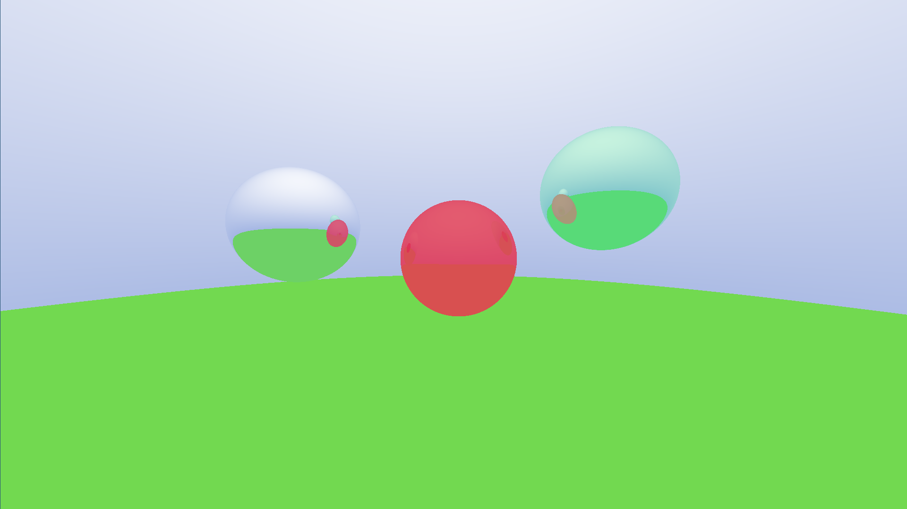

# Ray Tracer

My Ray Tracer implementation at first based on Ray Tracer in a Weekend but calculated with CUDA and shown with SDL3

WIP

### TODO:
- Refactor code (some __device__ code could be moved right into a classes etc)
- Add materials and diffusive lightning (possibly)
- Fix light source calculation
- Add bvh
- Add objloader and triangles
- Fix movement system - add processing of multiple keys
- Move from SDL3 to OpenGl interlop

